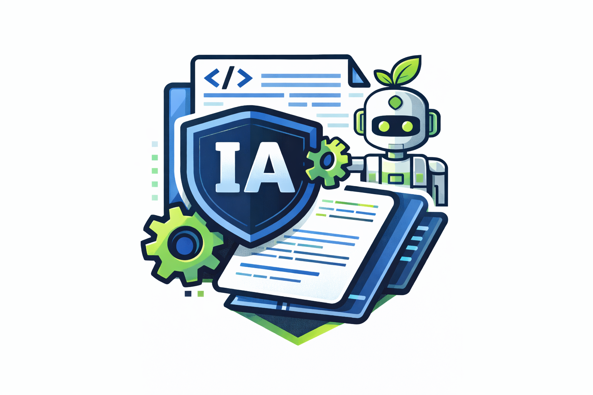

# IA-Agents Universal Kit



English version: [README.md](./README.md)  
Versión en español: [README-es.md](./README-es.md)

Se você quer entender como um agente de IA pode ajudar na sua jornada de desenvolvimento, leia [ai-agents-in-vscodium-chat-ptbr.md](./docs/articles/ai-agents-in-vscodium-chat-ptbr.md).

## Propósito

Este repositório é um kit reutilizável para governança de agentes em projetos de software.
Ele fornece:
- contrato global: `AGENTS.md`
- contratos por papel: `docs/agents/`
- fluxo/templates de issues: `docs/issues/`
- dois arquivos obrigatórios de contexto para cada projeto alvo:
  - `docs/software-overview.md`
  - `docs/limits.md`

## Pensado Para Quais Agentes/Ferramentas de IA

Este kit foi pensado para ser portátil entre agentes e assistentes de código conhecidos, principalmente:
- Agentes estilo Codex (usando `AGENTS.md`)
- Agentes baseados em Claude (usando `CLAUDE.md`)
- GitHub Copilot (usando `.github/copilot-instructions.md`)
- Cursor (usando `.cursorrules`)
- Windsurf/Cascade (usando `.windsurfrules`)
- Assistentes baseados em Gemini (usando `GEMINI.md`)

Regra central:
- `AGENTS.md` é o contrato global.
- Os arquivos específicos por ferramenta adaptam esse mesmo contrato para cada ecossistema.

## Como usar em outro projeto

Instalação direta pelo GitHub (recomendado):

```bash
bash <(curl -fsSL https://raw.githubusercontent.com/EDortta/AI-Agents/main/scripts/install-agents-kit.sh) \
  --target /caminho/do/seu-projeto
```

Se você já clonou este repositório:

```bash
./scripts/install-agents-kit.sh --target /caminho/do/seu-projeto
```

Importante:
- o instalador usa um readiness gate e termina com código diferente de zero até que:
  - `docs/software-overview.md` tenha `project_context_ready: yes`
  - `docs/limits.md` tenha `limits_ready: yes`

1. Copie (ou use symlink) destes artefatos no projeto alvo:
- `AGENTS.md`
- `docs/agents/`
- `docs/issues/`
- `docs/software-overview.md`
- `docs/limits.md`

2. Adapte apenas o que é específico do projeto:
- Preencha `docs/software-overview.md` com contexto do produto, arquitetura e objetivos.
- Preencha `docs/limits.md` com limites rígidos (in/out-of-scope, ações proibidas, gates de aprovação).
- Esses dois arquivos são obrigatórios e precisam ser editados pelo programador para que o agents-kit reconheça corretamente o que fazer no projeto.

3. Mantenha o núcleo genérico:
- Preserve estrutura e intenção de `AGENTS.md` e dos arquivos centrais em `docs/agents/`.
- Adicione extensões específicas somente quando necessário.

## Fluxo do Programador (Obrigatório)

Antes de codar no projeto alvo:
1. Ler `docs/software-overview.md` para entender o que está sendo desenvolvido.
2. Ler `docs/limits.md` para entender o que é permitido/proibido.
3. Planejar e implementar somente dentro desses limites.
4. Se uma solicitação conflitar com `docs/limits.md`, parar e pedir aprovação humana explícita.

Durante trabalho com issues:
1. Organizar trabalho em pastas de épico em `docs/issues/`.
2. Usar templates em `docs/issues/templates/`.
3. Incluir checagem de privacidade quando houver dados pessoais:
- `docs/issues/templates/privacy-checklist.template.md`

Fechamento de sessão em cada etapa:
1. Atualizar `handoff.md` com status, próximos passos, bloqueios, arquivos alterados e checks.
2. Registrar lições aprendidas curtas em `docs/napkin-lessons.md`.
3. Seguir `docs/workflows/session-close.md`.

Convenção de identificador de trabalho:
- Usar `work_id` no formato: `WK-YYYYMMDD-<short-slug>`.
- Manter o mesmo `work_id` nos docs de planejamento, handoff e mensagens de commit relacionadas.

## Setup mínimo recomendado no projeto

Ao adotar este kit, atualize primeiro:
- `docs/software-overview.md`: descrição do produto, arquitetura, módulos-chave, dependências.
- `docs/limits.md`: limites de escopo, limites de segurança, regras de branch/aprovação, operações proibidas.

Depois execute uma issue piloto usando `docs/issues/templates/task.template.md` para validar o processo.

## Setup de Credenciais

Use:
- `.credentials/README-ptbr.md`

Modelos disponíveis:
- `.credentials/programmer.token.example`
- `.credentials/reviewer.token.example`
- `.credentials/jira.json.example`

## Estrutura

- `AGENTS.md`: contrato universal de execução
- `scripts/install-agents-kit.sh`: instalador (execução local ou direta via raw do GitHub)
- `docs/agents/`: contratos por papel (programmer, reviewer, issue automation, security, privacy)
- `docs/issues/`: estrutura local de issues e templates
- `handoff.md`: log de handoff para retomada entre sessões
- `docs/napkin-lessons.md`: log conciso de lições aprendidas
- `docs/workflows/session-close.md`: checklist de fechamento de etapa/sessão
- `docs/workflows/dev-workflow-integration.md`: integração opcional de automação no fim de etapa

## Artigos

- EN: `docs/articles/ai-agents-in-vscodium-chat.md`
- PT-BR: `docs/articles/ai-agents-in-vscodium-chat-ptbr.md`
- ES: `docs/articles/ai-agents-in-vscodium-chat-es.md`
- Perspectiva do autor sobre a jornada de programação: [I used to turn off the internet for my developers](https://edortta71.medium.com/i-used-to-turn-off-the-internet-for-my-developers-f0d1747ee78f)
